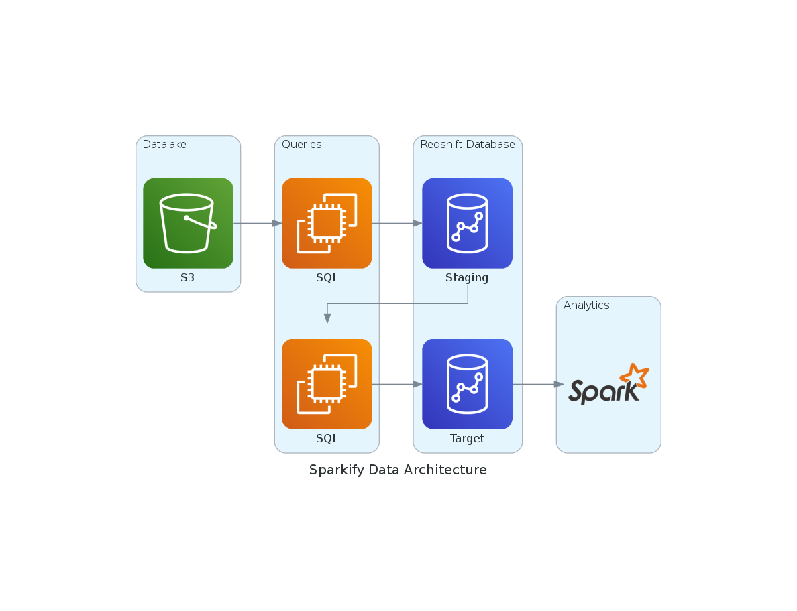

# Cloud Data warehouse

In this project, we build an ETL pipeline that loads data from S3 to staging tables on Redshift and execute SQL statements that create the analytics tables from these staging tables.

## Required packages
Python 3 is required for this project.
```bash
pip install s3fs
pip install configparser
pip install psycopg2
```

## Usage
There are two python scripts inside this repository that manage the whole ETL "create_tables.py" and "etl.py". 
The first script creates the tables in redshift that will be required for later insertion via the second script.
```bash
python3 create_tables.py
python3 etl.py
```

## Diagram of the project
To summarize the project and give a little overiew, this diagram will help you understand it at the higher level.


I really enjoyed this project because it is the first time I managed queries using redshift and an S3 bucket as a data source.

Bye!